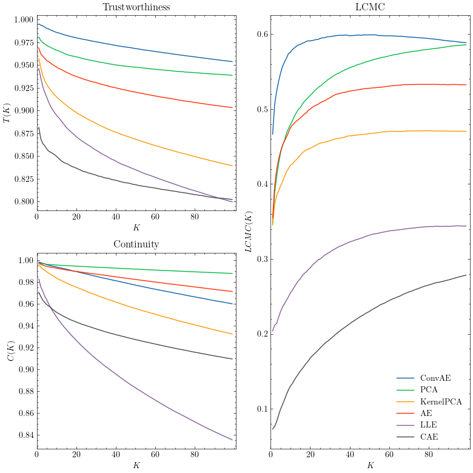

# Old but gold? - Statistics vs. Machine Learning in Dimensionality Reduction

This repository contains the python code for my bachelor thesis on the topic of dimensionality reduction techniques. It compares statistical dimensionality reduction techniques like PCA, Kernel PCA and LLE with newer machine learning methods for dimensionality reduction like Autoencoders. Specifically, fully connected as well as convolutional autoencoders and contractive autoencoders are studied.

The dimensionality reducers are compared via the trustworthiness, continuity and the local continuity meta-criterion (LCMC) on several datasets including artifical and real-world datasets. For an example, see below.



## Installation

`drcomp` requires Python 3.9 or higher and the following dependencies:

- matplotlib
- numpy
- pandas
- scikit-learn
- scikit-dimension
- torch
- skorch
- torchvision
- torchinfo
- hydra-core
- SciencePlots
- numba
- joblib

### Install

Install the package via pip

```bash
pip3 install git+https://github.com/MoritzM00/drcomp.git
```

## Usage

You can use the CLI to train and evaluate models. E.g. to train a PCA model on the MNIST Dataset, execute:

```bash
drcomp reducer=PCA dataset=MNIST
```

To train a model with different parameters, e.g. a PCA model on the mnist dataset with a intrinsic dimensionality of 10, execute:

```bash
drcomp reducer=PCA dataset=MNIST dataset.intrinsic_dim=10
```

Note that for some parameters it is cumbersome to change them on the command line. In this case, refer to the Development section below, and edit the configuration files directly.

Also, note that the CLI tool is case-sensitive for the arguments. E.g. `dataset=MNIST` is correct, but `dataset=mnist` is not. This is a limitation of the Hydra-CLI that is used to build the training script.

### Available datasets

The available datasets are:

- Swiss Roll (artificial) via `SwissRoll`
- Twin Peaks (artificial) via `TwinPeaks`
- MNIST via `MNIST`
- Labeled Faces in the Wild via `LfwPeople`
- Olivetti Faces via `OlivettiFaces`
- Facial Emotion Recognition (FER) of 2013 via `FER2013`
- ICMR via `ICMR`
- 20 News Groups via `News20`
- CIFAR10 via `CIFAR10`

All datasets except for ICMR and FER2013 can be downloaded automatically. For ICMR and FER2013, you need to download the datasets manually and place them in the `data` folder.

- Download ICMR from <https://www.kaggle.com/datasets/shibumohapatra/icmr-data?select=labels.csv> and place `.csv` files in `data/icmr`
- Download FER2013 from <https://www.kaggle.com/competitions/challenges-in-representation-learning-facial-expression-recognition-challenge> and place the files in `data/fer2013`

### Sweeping over multiple datasets and reducers

To sweep over multiple arguments for `reducer` or `dataset`, use the `--multirun` (`-m`) flag, e.g.:

```bash
drcomp --multirun reducer=PCA,kPCA,AE dataset=MNIST,SwissRoll
```

### Common tasks

Common tasks are simplified via the `makefile`.
To train all available models on a given dataset, invoke:

```bash
make train dataset=<dataset_name>
```

which will not evaluate the models. To evaluate the models, invoke:

```bash
make evaluate dataset=<dataset_name>
```

This will use pretrained models if available (otherwise it trains them first) and evaluates the models.

To train all models on all datasets, invoke:

```bash
make train-all
```

or alternatively:

```bash
make evaluate-all
```

Note that the last command can take a long time to execute, especially if there are no pretrained models available. This is because of the expensive evaluation of the models.

### Example Output

Example Output of the training and evaluation of a fully connected Autoencoder on the LFW-People dataset:

```
drcomp evaluate=True use_pretrained=True reducer=AE dataset=LfwPeople
```

Output:

```
[2023-01-09 18:50:27,507][drcomp.__main__][INFO] - Loading dataset: LfwPeople
[2023-01-09 18:50:27,765][drcomp.__main__][INFO] - Using dimensionality reducer: AE
[2023-01-09 18:50:27,778][drcomp.__main__][INFO] - Preprocessing data with StandardScaler.
[2023-01-09 18:50:27,892][drcomp.__main__][INFO] - Summary of AutoEncoder model:
[2023-01-09 18:50:30,615][drcomp.__main__][INFO] -
==========================================================================================
Layer (type:depth-idx)                   Output Shape              Param #
==========================================================================================
FullyConnectedAE                         [64, 2914]                --
├─Sequential: 1-1                        [64, 21]                  --
│    └─Linear: 2-1                       [64, 21]                  61,215
│    └─BatchNorm1d: 2-2                  [64, 21]                  42
│    └─Sigmoid: 2-3                      [64, 21]                  --
├─Sequential: 1-2                        [64, 2914]                --
│    └─Linear: 2-4                       [64, 2914]                64,108
│    └─BatchNorm1d: 2-5                  [64, 2914]                5,828
│    └─Sigmoid: 2-6                      [64, 2914]                --
==========================================================================================
Total params: 131,193
Trainable params: 131,193
Non-trainable params: 0
Total mult-adds (M): 8.40
==========================================================================================
Input size (MB): 0.75
Forward/backward pass size (MB): 3.01
Params size (MB): 0.52
Estimated Total Size (MB): 4.28
==========================================================================================
[2023-01-09 18:50:30,617][drcomp.__main__][INFO] - Loading pretrained model because `use_pretrained` was set to True.
[2023-01-09 18:50:30,619][drcomp.__main__][WARNING] - Could not find pretrained model at models/LfwPeople/AE.pkl.
[2023-01-09 18:50:30,621][drcomp.__main__][INFO] - Training model...
[2023-01-09 18:50:42,679][drcomp.__main__][INFO] - Training took 12.06 seconds.
[2023-01-09 18:50:42,681][drcomp.__main__][INFO] - Saving model...
[2023-01-09 18:50:42,750][drcomp.__main__][INFO] - Evaluating model...
[2023-01-09 18:50:45,783][drcomp.__main__][INFO] - Mean Trustworthiness: 0.98
[2023-01-09 18:50:45,786][drcomp.__main__][INFO] - Mean Continuity: 0.99
[2023-01-09 18:50:45,788][drcomp.__main__][INFO] - Max LCMC: 0.59
[2023-01-09 18:50:45,789][drcomp.__main__][INFO] - Evaluation took 2.94 seconds.
[2023-01-09 18:50:45,791][drcomp.utils._saving][INFO] - Saved metrics to metrics/LfwPeople_AE.json
[2023-01-09 18:50:45,798][drcomp.__main__][INFO] - Finished in 18.29 seconds.
```

## Development

Create a virtual environment first, for example by executing:

```bash
python3 -m venv .venv
source .venv/bin/activate
```

and then install the package `drcomp` locally with pip:

```bash
pip3 install -r requirements.txt
pip3 install -r requirements-dev.txt
pip3 install -e .
```

and install the pre-commit hooks by executing:

```bash
pre-commit install
```

Alternatively, use `make setup && make install-dev` to execute the above commands.

### Repository Structure

The Repository structure is as follows:

```
.
├── drcomp
│   ├── __init__.py
│   ├── __main__.py         # CLI entrypoint, for training and evaluation
│   ├── autoencoder         # Implementation of the autoencoders architectures in PyTorch
│   ├── conf               # configuration files
│   │   ├── config.yaml
│   │   ├── dataset
│   │   ├── dataset_reducer
│   │   └── reducer
│   ├── dimensionality_reducer.py
│   ├── plotting.py     # Plotting utilities functions
│   ├── reducers        # DR techniques, that implement the DimensionalityReducer interface
│   ├── scripts         # scripts for comparison and visualization
│   └── utils           # utility functions, mainly for the cli
├── figures             # Figures generated by the scripts
├── makefile            # Shortcuts for common tasks
├── metrics             # Metrics generated by the scripts
├── models              # Trained models and preprocessors
├── notebooks           # Jupyter notebooks for data exploration
...
└── setup.py
```

The configuration specifications can be found in the `drcomp/conf` directory. The parameter settings for the dimensionality reduction techniques can be found in `drcomp/conf/reducer`. and the dataset configs in `drcomp/conf/dataset`. The `drcomp/conf/dataset_reducer` folder contains specific configurations for certain combinations of datasets and reducers.

### Debugging the CLI

To enable debug level logging, execute the `drcomp` command with

```bash
drcomp hydra.verbose=True
```
